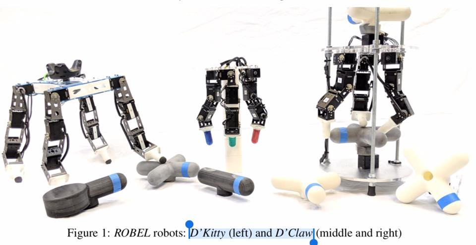
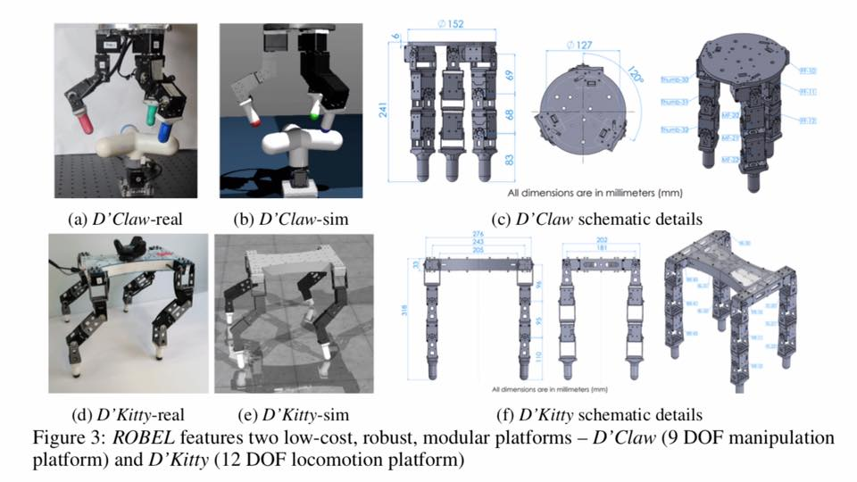
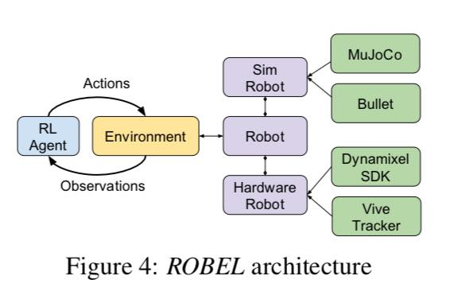
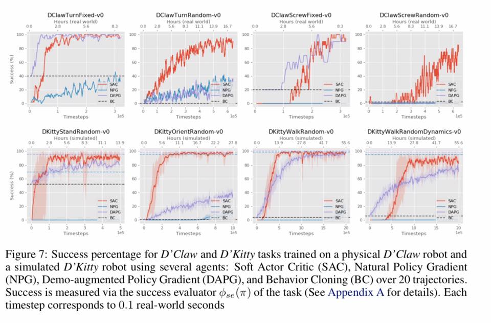

# D-Kitty & D-Claw: Robotics-Benchmarks-for-Learning-with-Low-Cost-Robots

Welcome 2 ROBEL-based low-cost robots - D’Kitty & D’Claw.
(Robotics Benchmarks for Learning with Low-Cost Robots)

Great effort on affordable, modular, robust & easy-to-maintain robots aimed to accelerate reinforcement learning research.

The Google ROBEL benchmark help track AI quality on affordable robots.

Read https://arxiv.org/pdf/1909.11639.pdf

#reinforcementlearning 

#robot #robotics
